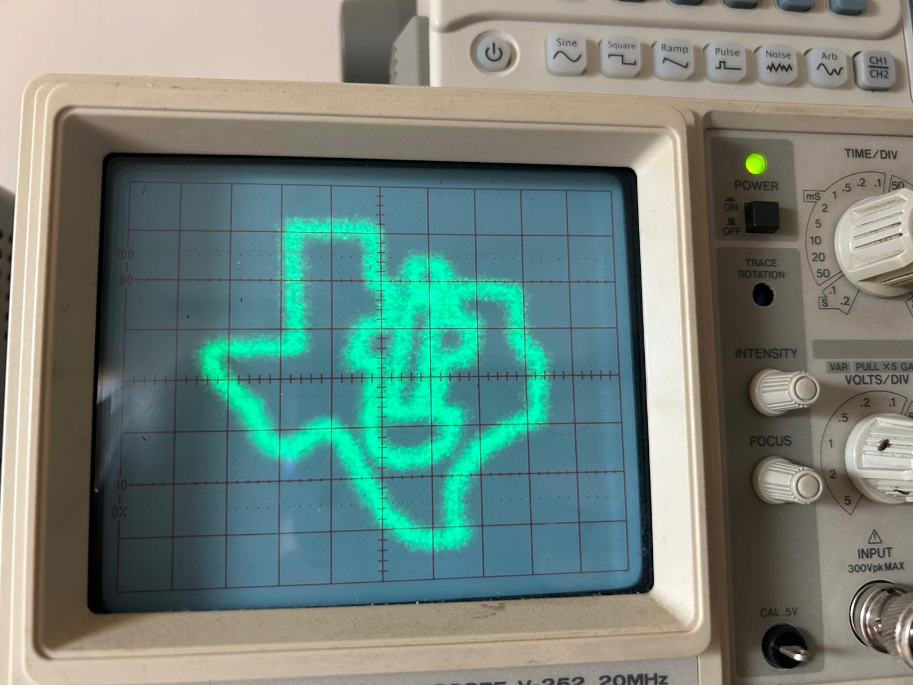
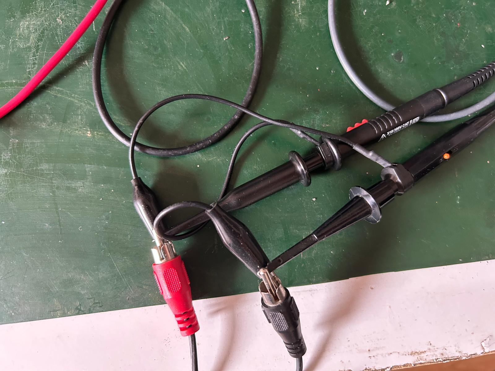

Vector graphics on an oscilliscope
==================================
I was thinking it would be cool to use my old analog dual channel scope as
vector graphics display.  If only I had a DAC from my PC to output analog
signals.  But wait, stereo analog output is a two channel DAC - why not use
audio.  I tried it out and it does work. 

Taking the Texas Instruments [logo in SVG][1] as an example, I cut out the parts
that draw the logo and separated them into seperate lines.  The file texas.lst
contains the SVG instructions to create the logo.

Reading these into some code to render lines and output using pulse audio
generates this image:

Pics
----

[1]: https://upload.wikimedia.org/wikipedia/commons/b/ba/TexasInstruments-Logo.svg
